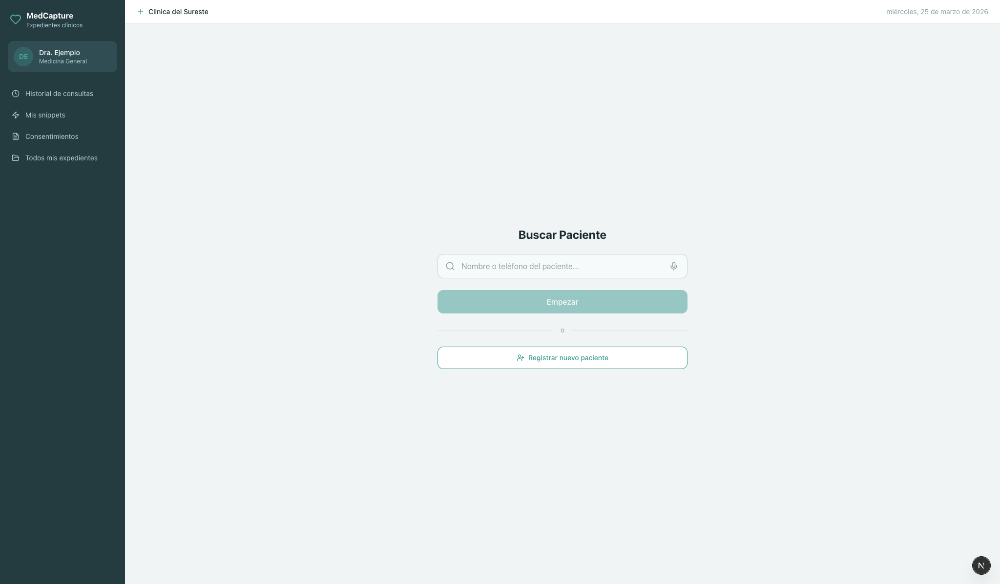
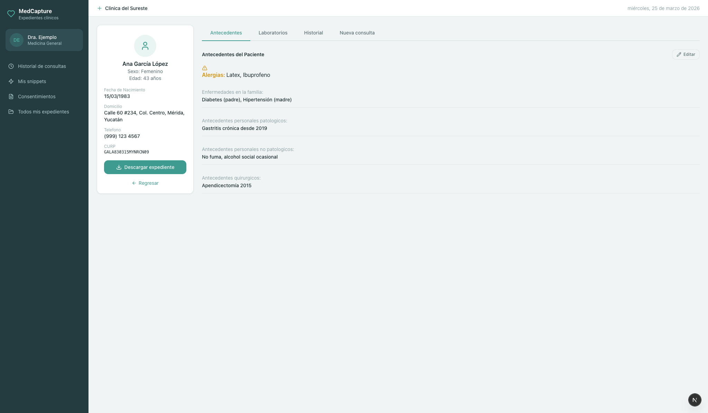
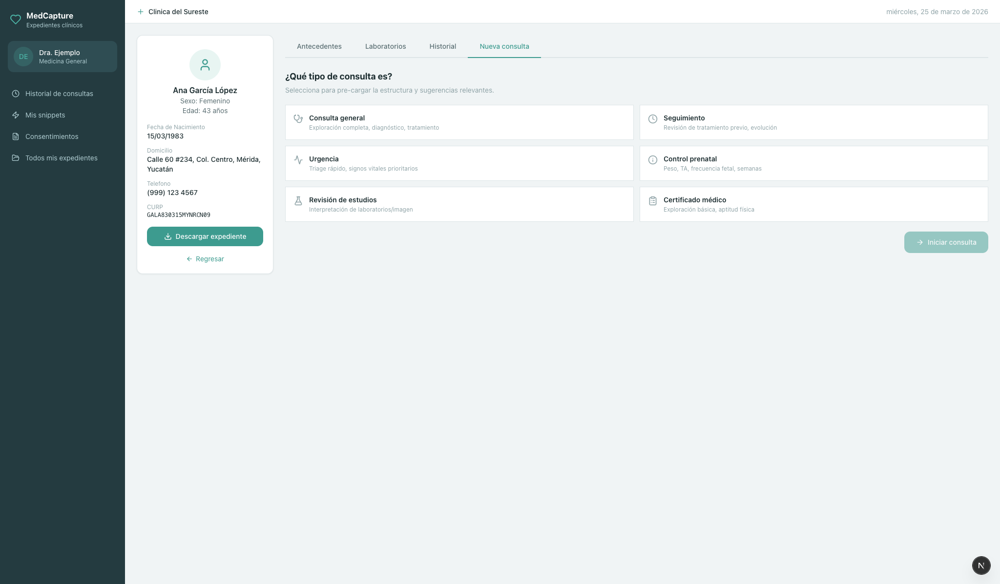
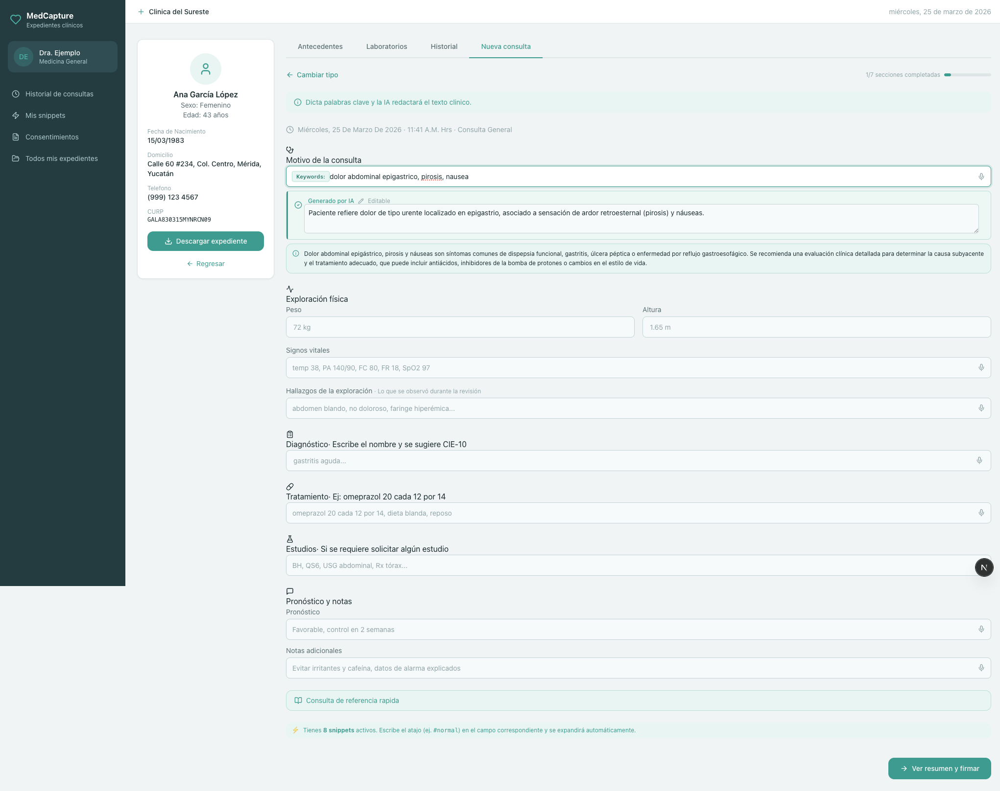
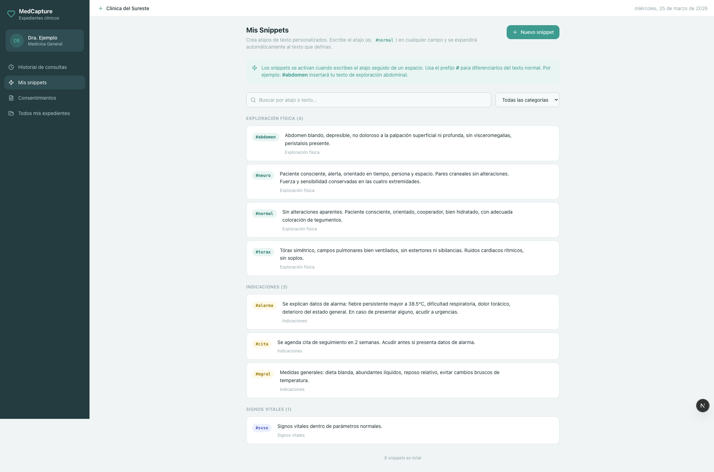

<h1>MedCapture</h1>

<p>Expediente clinico electronico para consultorios. El medico escribe keywords o dicta por voz y la IA genera la nota clinica formal. Cumple con la estructura de NOM-004-SSA3-2012.</p>

<br>

## Que es

Un sistema donde el doctor escribe abreviaciones rapidas durante la consulta:

```
dolor abdominal epigastrico, pirosis, nausea
```

Y la IA lo convierte en texto clinico listo para el expediente:

> Paciente refiere dolor de tipo urente localizado en epigastrio, asociado a sensacion de ardor retroesternal (pirosis) y nauseas.

El texto generado es editable en el momento. No hay que esperar a otra pantalla para corregirlo.

<br>

## Screenshots

<table>
<tr>
<td width="50%">
<strong>Busqueda de pacientes</strong><br>
Busca por nombre, telefono o CURP. Soporte para dictado por voz.
<br><br>

</td>
<td width="50%">
<strong>Expediente del paciente</strong><br>
Tarjeta con datos demograficos, antecedentes editables, historial de consultas y laboratorios.
<br><br>

</td>
</tr>
<tr>
<td width="50%">
<strong>Seleccion de tipo de consulta</strong><br>
6 tipos: general, seguimiento, urgencia, prenatal, revision de estudios, certificado medico. Cada uno muestra campos y placeholders diferentes.
<br><br>

</td>
<td width="50%">
<strong>Formulario con expansion por IA</strong><br>
Escribe keywords, presiona Enter, y la IA redacta el texto clinico. Editable in-place. Cada campo tiene dictado por voz.
<br><br>

</td>
</tr>
<tr>
<td colspan="2">
<strong>Snippets personalizados</strong><br>
El medico define sus propios atajos de texto. <code>#abdomen</code> se expande a su texto de exploracion abdominal. Organizados por categoria (exploracion fisica, indicaciones, signos vitales). Se pueden mezclar con texto libre: <code>#mgral omeprazol 20 cada 12</code> expande el snippet y manda el resto a la IA.
<br><br>

</td>
</tr>
</table>

<br>

## Features

**Consulta**
- 6 tipos de consulta con campos y placeholders contextuales
- Expansion de keywords por IA (Gemini 2.5 Flash Lite) por seccion
- Dictado por voz en todos los campos de texto y en busqueda de CIE-10
- Texto generado editable antes de guardar
- Autocompletado de diagnosticos CIE-10
- Calculo automatico de IMC
- Barra de progreso por secciones completadas
- Validacion NOM-004 en pantalla de revision
- Descarga de consulta como .txt

**Snippets**
- Atajos de texto personalizados por medico
- Expansion por categoria: un snippet de "exploracion" solo se activa en el campo de hallazgos
- Combinables con texto libre (el snippet se pre-expande y el resto va a la IA)
- CRUD completo con busqueda y filtros por categoria

**Pacientes**
- Registro con datos demograficos y antecedentes medicos completos
- Busqueda por nombre, telefono o CURP
- Antecedentes editables que persisten en BD
- Historial de consultas y estudios por paciente
- Descarga del expediente

<br>

## Stack

| | |
|---|---|
| Framework | Next.js 15 (App Router, Turbopack) |
| Base de datos | SQLite via better-sqlite3 |
| IA | Gemini 2.5 Flash Lite via Vertex AI |
| Estilos | Tailwind CSS v4 + CSS custom properties |
| Lenguaje | TypeScript |

<br>

## Setup

```bash
pnpm install
cp .env.example .env
```

Edita `.env` con tu proyecto de GCP y coloca el archivo de credenciales:

```
GOOGLE_APPLICATION_CREDENTIALS=./gcp-service-account.json
GCP_PROJECT_ID=tu-proyecto-gcp
GCP_LOCATION=us-central1
```

```bash
pnpm dev
```

Abre http://localhost:3000/consulta

La base de datos se crea automaticamente en `data/expediente.db` con datos de demo (3 pacientes, catalogo CIE-10, 8 snippets de ejemplo). Para resetear, borra el archivo y reinicia.

<br>

## Estructura del proyecto

```
src/
  app/
    consulta/                  Busqueda y registro de pacientes
      [pacienteId]/            Detalle: antecedentes, labs, historial, nueva consulta
        nueva-consulta/        Formulario + revision + completado
      snippets/                Gestion de snippets
      expedientes/             Lista de todos los pacientes
      historial/               Historial global de consultas
    api/
      patients/                CRUD pacientes
      notas/                   CRUD notas de evolucion
      snippets/                CRUD snippets
      expand/                  Expansion de keywords por IA
      cie10/                   Busqueda en catalogo CIE-10
      referencia/              Referencia clinica rapida
  components/                  Componentes compartidos
  lib/
    db.ts                      Schema SQLite + seeding
    gemini.ts                  Cliente Vertex AI
    prompts.ts                 Prompts del sistema
    format.ts                  Utilidades de formato
    constants.ts               Constantes compartidas
    download.ts                Descarga de archivos
    nom004-validator.ts        Validacion NOM-004
  types/
    expediente.ts              Tipos TypeScript
```

<br>

## Limitaciones (MVP)

- Sin autenticacion. El medico esta hardcoded como `demo-doc-1`.
- Sin soporte mobile. El layout requiere pantallas de al menos 900px.
- La seccion de consentimientos es un stub.
- SQLite local, no hay sync entre dispositivos.
